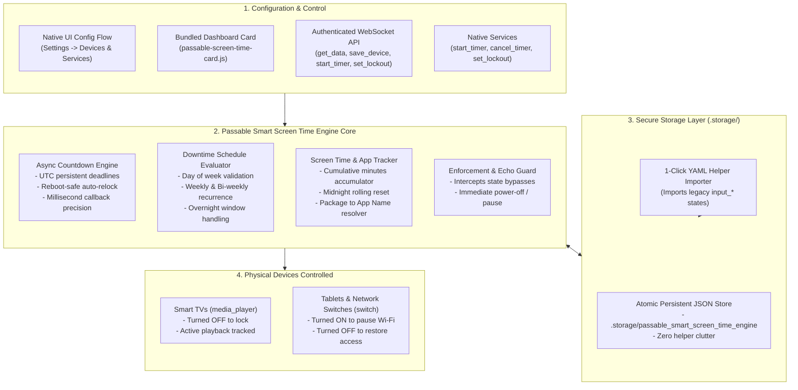

# 📺 Passable Smart Screen Time Engine

[](https://github.com/hacs/default)
[](https://github.com/GBear09/passable-smart-screen-time-engine/releases)
[](LICENSE)

An intelligent, unified screen time supervision, parental downtime, and device access control engine for Home Assistant. Part of the **Passable** home automation suite alongside [`passable-smart-light-engine`](https://github.com/GBear09/passable-smart-light-engine), [`passable-smart-climate-engine`](https://github.com/GBear09/passable-smart-climate-engine), and [`passable-smart-lock-engine`](https://github.com/GBear09/passable-smart-lock-engine).

Runs natively on Home Assistant Core's asynchronous engine with atomic `.storage` persistence, zero manual helper entity clutter, reboot-resilient countdown timers, daily viewing minute tracking, streaming app telemetry, and a bundled Lovelace dashboard card.

---

## ⚙️ Key Features

- **📺 Universal Media & Network Supervision**: Unified supervision across **Media Players** (Smart TVs, Android TVs, Apple TVs, webOS) and **Network Switches** (e.g. Eero Wi-Fi pause for personal tablets).
- **⏱️ Persistent "One More Show" Timers**: Start temporary viewing windows (`15m`, `20m`, `30m`, `45m`, custom). The engine unlocks and powers on the device, tracks expiration with UTC timestamps that **survive Home Assistant reboots**, and cleanly shuts off / locks the device upon expiry.
- **📅 7-Day Downtime Schedule Engine**: Multi-day circular selection bubbles (`S M T W T F S`) with weekly and bi-weekly recurrence. Robust Python evaluation seamlessly handles overnight downtime spans past midnight.
- **📊 Live Daily Screen Time Telemetry**: In-memory minute-by-minute tracking exposes `sensor.<device>_screen_time_today` with automatic rolling midnight resets. Usable across your dashboards and automations with zero database query lag.
- **🎯 Streaming App Intelligence**: Automatically decodes Android TV / Google TV package IDs and webOS sources into clean brand titles (`Netflix`, `Disney+`, `YouTube`, `Prime Video`, `Plex`, `PBS KIDS`).
- **🛡️ Aggressive Lockout Enforcement**: Event-driven Python listeners intercept state bypasses immediately. If a child attempts to turn a restricted TV back on, the engine instantly forces it back off.
- **🛑 External Household Restrictions**: Integrate global household rules (e.g. *Hudson Potty Request*, *Homework Time*) with custom TTS audio announcements.
- **📦 Bundled Dashboard Card**: Serves `passable-screen-time-card.js` automatically without manual Lovelace resource registration. Includes an alias for `custom:passable-device-lockout-card` for seamless drop-in backwards compatibility.
- **🔄 1-Click Legacy Helper Migration**: Automatically detects existing `input_text.device_lockout_schedule_*` and `input_boolean.device_lockout_*` helpers and imports all devices, schedules, and states into native storage with zero manual re-entry.

---

## 📂 System Architecture



---

## 📦 Installation

### Option 1: Via HACS (Recommended)

1. Open **HACS** in your Home Assistant instance.
2. Click the three dots `⋮` in the top right corner and select **Custom repositories**.
3. Paste the repository URL:
   ```text
   https://github.com/GBear09/passable-smart-screen-time-engine
   ```
4. Set the Category to **Integration** and click **Add**.
5. Locate **Passable Smart Screen Time Engine**, click **Download**, and restart Home Assistant.

---

## 🚀 Setup & Migration

### 1. Add the Integration
1. In Home Assistant, navigate to **Settings → Devices & Services**.
2. Click **Add Integration** and search for **Passable Smart Screen Time Engine**.
3. Select your target TVs (`media_player.*`) and Network Switches (`switch.*`).

### 2. 1-Click Migration from Legacy Helpers
If you previously used the Device Lockout Blueprint with `input_text` and `input_boolean` helpers:
* Go to **Developer Tools → Services** and run:
  ```yaml
  service: passable_smart_screen_time_engine.import_legacy_helpers
  ```
  *(Or click **Import Legacy Helpers** in the card settings).*
* All existing schedules, active days, and lockout states will instantly import into native storage!

---

## 🎛️ Dashboard Card Usage

The card is automatically registered as a Lovelace resource upon integration setup.

```yaml
type: custom:passable-screen-time-card
title: Screen Time & Downtime
subtitle: Family Media Supervision
```

*(Note: The card also responds to `type: custom:passable-device-lockout-card` for 100% backwards compatibility).*

---

## 🛠️ Provided Entities & Services

### Global & Master Entities
* **Active Lockouts Sensor**: `binary_sensor.passable_screen_time_active_lockouts` (`on` when any device is locked, includes `locked_count`, `locked_devices`, `active_restrictions`).
* **Master Lockout Switch**: `switch.passable_master_device_lockout` (Turn ON to lock all, OFF to unlock all, Toggle to toggle all).

### Entities per Managed Device
* **Lockout Switch**: `switch.<device>_screen_time_lockout` (ON = Locked, OFF = Unlocked).
* **Schedule Switch**: `switch.<device>_screen_time_schedule` (Master schedule enable/disable).
* **Screen Time Sensor**: `sensor.<device>_screen_time_today` (Cumulative minutes watched today).
* **Active App Sensor**: `sensor.<device>_active_app` (Current app e.g. `Disney+`, `YouTube`).

### Services
* `passable_smart_screen_time_engine.toggle_all_lockouts`: Master toggle: unlocks all devices if any are locked; locks all if all are unlocked.
* `passable_smart_screen_time_engine.set_lockout`: Manually lock or unlock a device (or all devices by omitting `device_id`).
* `passable_smart_screen_time_engine.start_timer`: Start a countdown viewing window.
* `passable_smart_screen_time_engine.cancel_timer`: Cancel an active timer.
* `passable_smart_screen_time_engine.import_legacy_helpers`: Scan and import schedules from legacy helpers into `.storage`.

---

## 👨‍👩‍👧 Part of the Passable Suite

* 💡 [**Passable Smart Light Engine**](https://github.com/GBear09/passable-smart-light-engine): Adaptive lux curve learning, presence simulation, and holiday lighting.
* 🔐 [**Passable Smart Lock Engine**](https://github.com/GBear09/passable-smart-lock-engine): Multi-door sync, temporary access timers, and keypad/biometric actor resolution.
* 🌡️ [**Passable Smart Climate Engine**](https://github.com/GBear09/passable-smart-climate-engine): Intelligent HVAC performance scorecard and comfort optimization.
* 📺 [**Passable Smart Screen Time Engine**](https://github.com/GBear09/passable-smart-screen-time-engine): Downtime schedules, viewing timers, and streaming telemetry.

---

## 📄 License

MIT License © 2026 [GBear09](https://github.com/GBear09)
